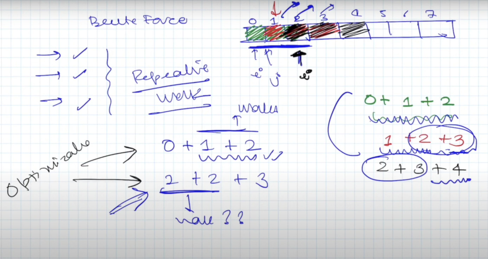
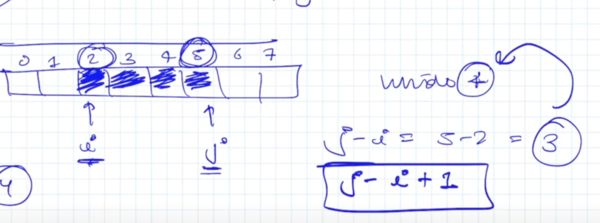

# Sliding Window

1.png

here $2+3$ is calculated twice for the array [`1,2,3,4,5,6,7,8]` for window size = 3

## How to identify ?

1. array / string subarray sum or any other property
2. Largest / smallest ...
3. A number $k$ may be given (or we will have calculate on our own) which will be window size

## Types

1. Fix Size

   1. Calculate a property for all window sizes

2. Variable Size

   1. Calculate Largest Window size where a property holds true (example sum == 5)
   2. Smallest Window size size

$1$ and $2$ are reverse of each other in context of input & output

## [1. Maximum Sum Subarray of size K](https://www.geeksforgeeks.org/problems/max-sum-subarray-of-size-k5313/1)

Let `i` represent the start of the window and `j` represent the start and end indices

1.
2. number of windows = `arr.length - window.length + 1`

2.png

```java
class Solution{
    static long maximumSumSubarray(int k, ArrayList<Integer> arr,int n){
        int i = 0; int j = 0;
        long sum = 0;
        long ans = 0;
        while(j < n){
            sum += arr.get(j);
            if(j-i+1 < k){
                j++;
            }
            else{
                ans = Math.max(ans,sum);
                sum -= arr.get(i);
                i++; j++;
            }
        }
        return ans;
    }
}
```

# [2. First negative integer in every window of size k](https://www.geeksforgeeks.org/problems/max-sum-subarray-of-size-k5313/1)

```java
public long[] printFirstNegativeInteger(long arr[], int n, int k)
    {
        Queue<Integer> q = new LinkedList<>();
        int i = 0; int j = 0;
        long[] ans = new long[n-k+1];
        while(j < n){
            if(arr[j] < 0) q.add(j);
            if(j-i+1 < k){
                j++;
            }
            else{
                while(!q.isEmpty() && (q.peek() < i || q.peek() > j)) q.remove();
                if(!q.isEmpty()) ans[i] = arr[q.peek()];
                else ans[i] = 0;
                i++; j++;
            }
        }
        return ans;
    }
```

## [3. Sliding Window Maximum](https://leetcode.com/problems/sliding-window-maximum/description/)


Obseravation:

1. $3 > 1$ and $3$ is in the window
2. $1$ will be of no use as we move the window right but this is not the case for $-1$

We will only keep elements which are of use in Deque. Order of elements present in the deque is same as in the array. Therefore if the first element is in the window all elements on the right will also be.

Front the deque will always have the max element. We will add elements on right after deleting all elements which are smaller to it. Because numbers coming before the larger number are of no use.

> remove from left - add to right

```java
class Solution {
    static ArrayList<Integer> max_of_subarrays(int nums[], int n, int k) {
        ArrayList<Integer> ans = new ArrayList<>();
        Deque<Integer> dq = new ArrayDeque<>();
        int i=0; int j=0;
        while(j < n){
            while(!dq.isEmpty() && nums[dq.getLast()] <= nums[j]) dq.removeLast();
            dq.addLast(j);
            if(j-i+1 < k) j++;
            else{
                ans.add(nums[dq.getFirst()]);
                i++;
                if(dq.getFirst() < i) dq.removeFirst();
                j++;
            }
        }
        return ans;
    }
}
```
