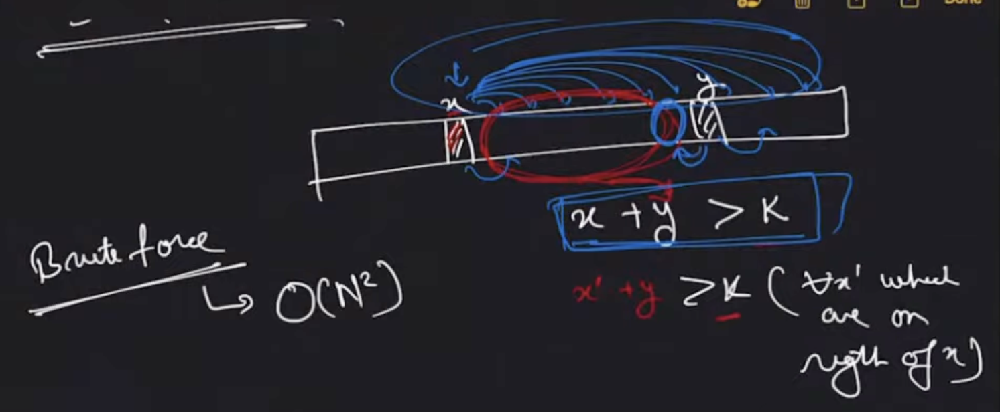
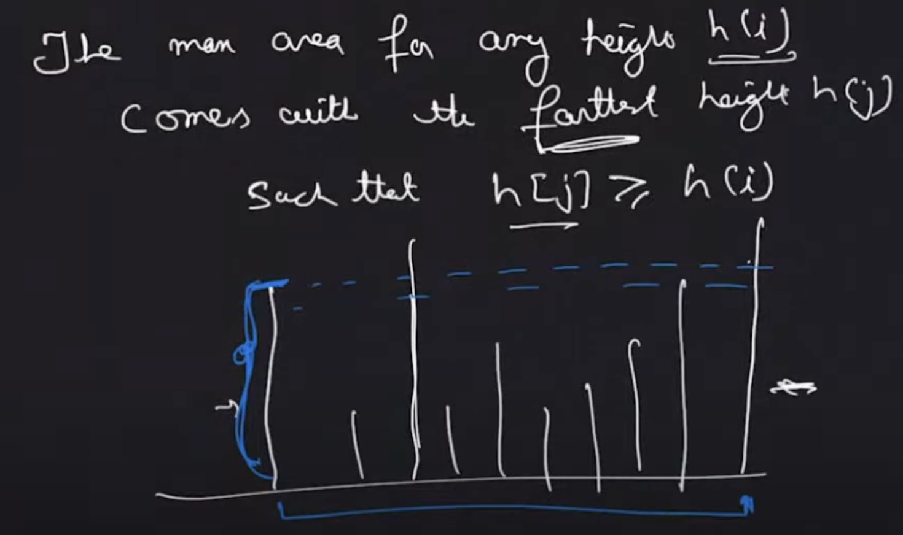
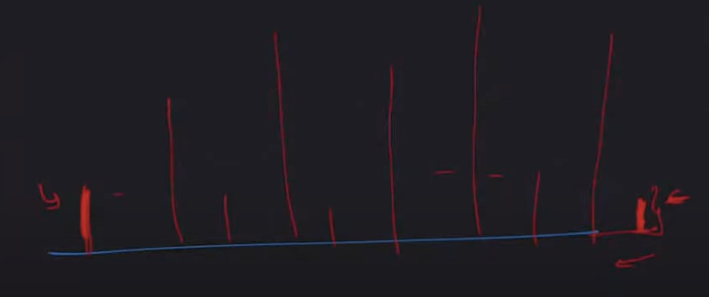

# Two Pointer

1 pointer, 2 pointer, 3 pointer, ... , n pointer. All fall under this umbrella term.

4 thing to keep in mind

1. Physical significance of pointers
2. How to initialize ?
3. How to move the pointers
4. When to stop

## Q1) Given a sorted array, find number of pairs having sum = k

Use O(1) space

Let array be `[1, 4, 4, 5, 5, 5, 6, 6, 11] `



we will only move $x$ to right and $y$ to left as we would have reached here after finding all solutions that lie on the outer area of $x$ and $y$

Cases (In this example x and y denote element's value rather than ther)

1. $x+y > k$$\implies x^{'} + y > k$ $\; \; \forall \; \; x^{'} \in \left( x,y \right)$
2. $x + y < k \implies x + y^{'} < k \; \; \forall \; \; y^{'} \in \left( x,y \right) $
3. $x + y = k$
   1. $x = y$
   2. $x \neq y$

```java
class Solution {
    int getPairsCount(int[] arr, int n, int k) {
        Arrays.sort(arr);
        int i=0; int j=n-1; int count = 0;
        while(i < j){
            if(arr[i] + arr[j] < k){
                i++;
            }else if(arr[i] + arr[j] > k){
                j--;
            }else{
                if(arr[i] == arr[j]){
                    int c = j - i + 1;
                    return count + c * (c-1) / 2;
                }else{
                    int left = 1;
                    while(arr[i] == arr[i+1]){
                        i++; left++;
                    }
                    int right = 1;
                    while(arr[j] == arr[j-1]){
                        j--; right++;
                    }
                    count += left * right;
                    i++; j--;
                }
            }
        }
        return count;
    }
}
```

## Count distinct pairs with difference K

```java
class Solution
{
    public int TotalPairs(int[] arr, int k)
    {
        Arrays.sort(arr);
        int n = arr.length;
        int i = 0; int j = 1;
        int count = 0;
        while(j < n){
            if(arr[j] - arr[i] == k && i != j){
                count++;
                while(i+1 < n && arr[i] == arr[i+1]) i++;
                while(j+1 < n && arr[j] == arr[j+1]) j++;
                i++; j++;
            }else if(arr[j] - arr[i] > k) i++;
            else j++;
        }
        return count;
    }
}
```

## [Container with most water](https://leetcode.com/problems/container-with-most-water/)

Brute Force: Take combination of every two bars $O(n^2)$

Notice:



As soon as for a particular bar(say first bar) with height `h[i]` we find a bar with height `h[j]` where `h[j] >= h[i]` we stop.

It doesn't matter how long the height of j is, it should just be greater that i. And if we move inwards after this we would only be decreasing the volume.

Also notice:



for the shorter bar(here on right) we have already found `h[j]` s.t `h[j] >= h[i]` so we don't need to move the larger bar by fixing the shorter one.

```java
class Solution {
    public int maxArea(int[] height) {
        int l = 0;
        int r = height.length - 1;
        int max = 0;
        while(l < r){
            max = Math.max(max,(r-l)*Math.min(height[l],height[r]));
            if(height[l] < height[r]) l++;
            else r--;
        }
        return max;
    }
}
```
